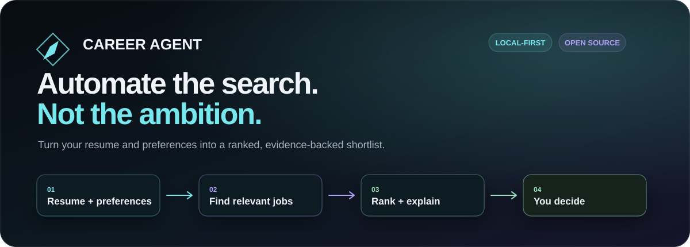
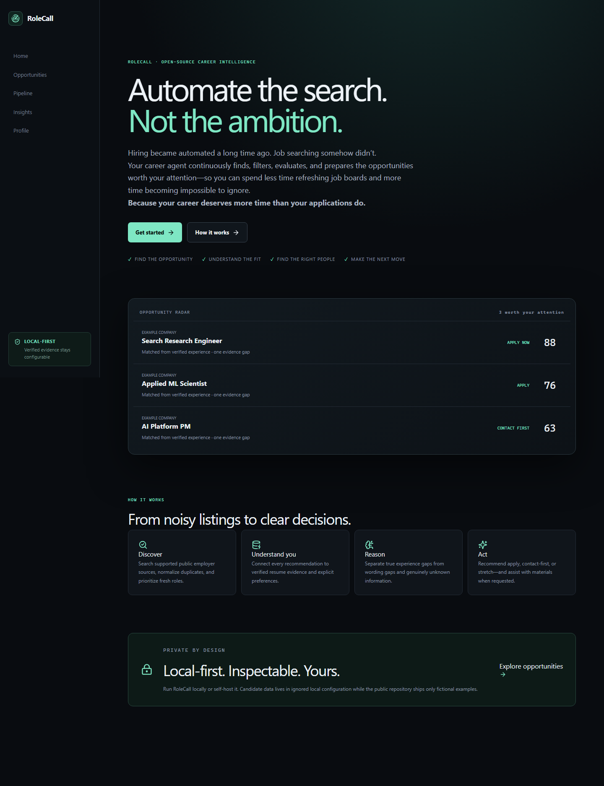
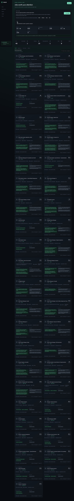
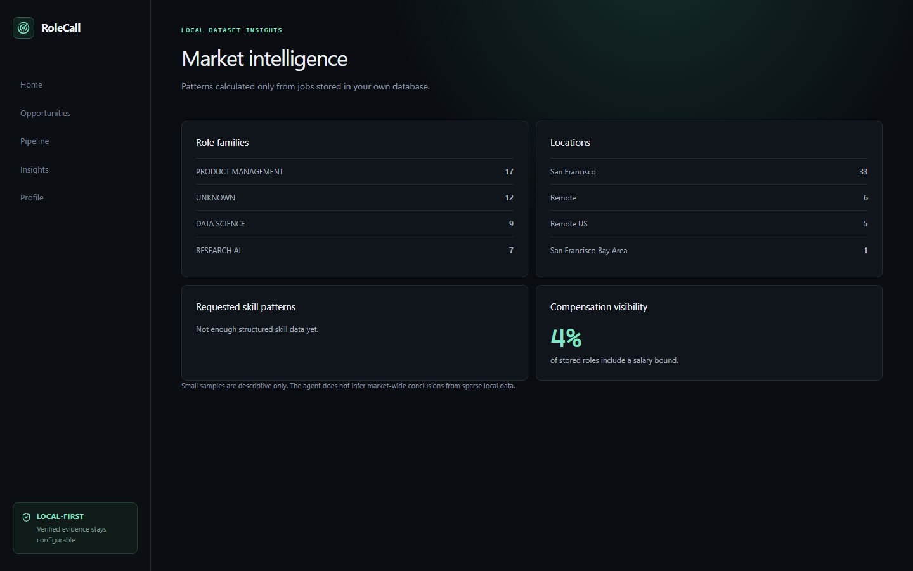
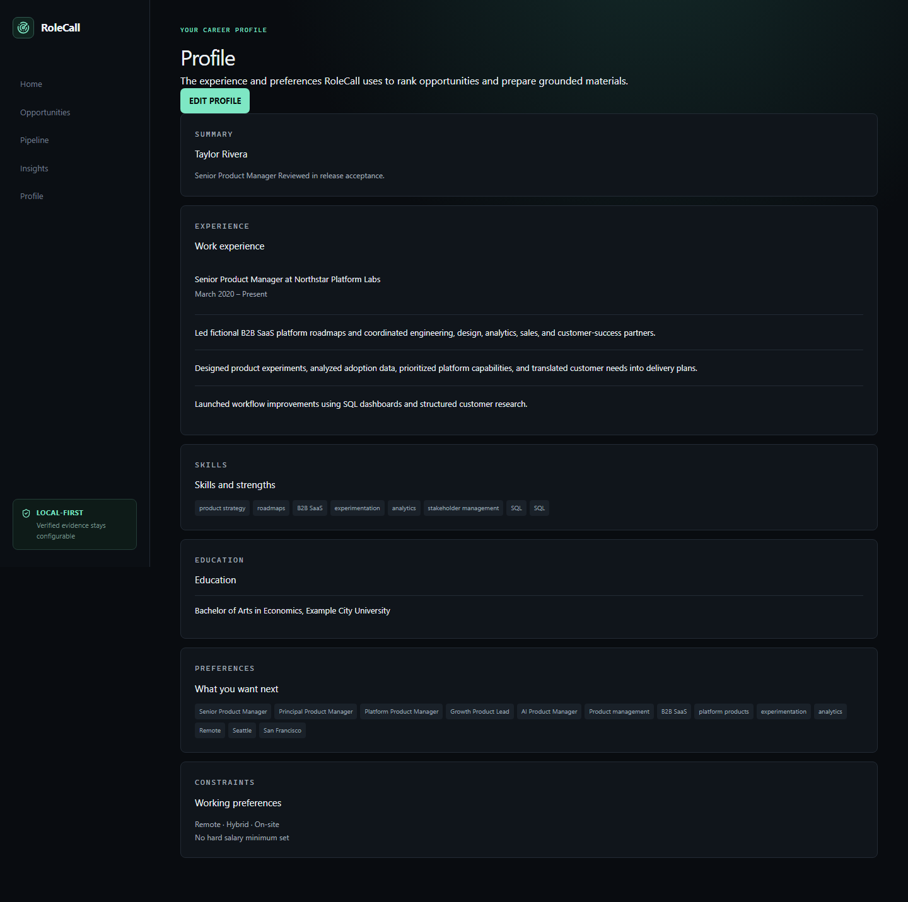
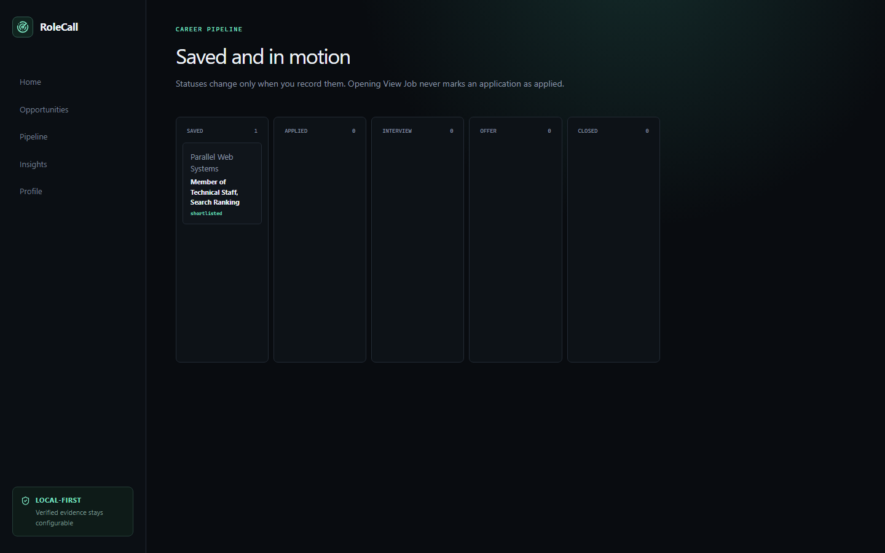
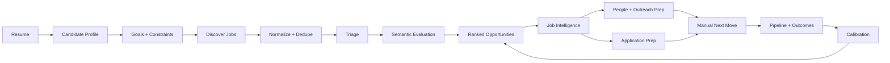
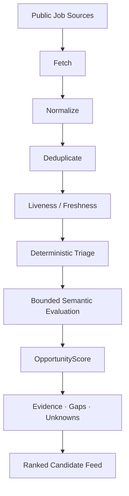
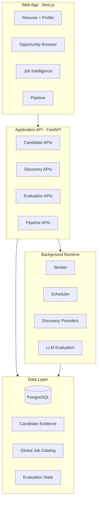

<div align="center">



# RoleCall

### Automate the search. Not the ambition.

**An open-source career intelligence agent that finds, filters, evaluates, and prepares the opportunities worth your attention.**

<br/>


<br/>

**Find the opportunity. Understand the fit. Find the right people. Make the next move.**

</div>

---

## Why RoleCall

Hiring became automated a long time ago. Job searching somehow didn’t.

RoleCall continuously helps you **find, filter, evaluate, and prepare** opportunities so you can spend less time refreshing job boards and more time becoming **impossible to ignore**.

> **Because your career deserves more time than your applications do.**

RoleCall is not an auto-apply bot. It is a **career intelligence system** built to help a person make better decisions faster while keeping the final application and outreach actions in human hands.

---

## See RoleCall in action

<table>
<tr>
<td width="50%" valign="top">

</td>
<td width="50%" valign="top">

</td>
</tr>
<tr>
<td align="center"><b>Start with your career, not a search box</b></td>
<td align="center"><b>See the opportunities worth your attention</b></td>
</tr>

<tr>
<td width="50%" valign="top">

</td>
<td width="50%" valign="top">

</td>
</tr>
<tr>
<td align="center"><b>Explore the market</b></td>
<td align="center"><b>Understand the evidence RoleCall is using</b></td>
</tr>
</table>

<p align="center">

</p>

<p align="center"><b>Keep the opportunities that matter organized</b></p>

---

## What RoleCall does

<table>
<tr>
<td width="33%" valign="top">

### 01 · Understands you

Upload a résumé and RoleCall builds a structured candidate profile from grounded evidence.

- PDF / DOCX / TXT ingestion
- experience + skill extraction
- candidate evidence model
- goals and constraints
- editable review flow

</td>
<td width="33%" valign="top">

### 02 · Searches broadly

RoleCall discovers public opportunities across supported company career systems and normalizes them into one job catalog.

- multi-provider discovery
- freshness + liveness checks
- normalization
- deduplication
- canonical employer links

</td>
<td width="33%" valign="top">

### 03 · Evaluates fit

Jobs are ranked using deterministic signals plus bounded semantic evaluation.

- opportunity scoring
- evidence-backed strengths
- explicit gaps
- unknowns
- constraint checks
- career-transition awareness

</td>
</tr>

<tr>
<td width="33%" valign="top">

### 04 · Builds company intelligence

RoleCall turns a posting into a clearer decision surface.

- company context
- role signals
- fit explanation
- missing evidence
- practical next steps

</td>
<td width="33%" valign="top">

### 05 · Finds relevant people

When public evidence is available, RoleCall can surface people most relevant to the opportunity.

- same / adjacent role
- same team or domain
- senior functional peers
- verified manager evidence
- relevant recruiters

</td>
<td width="33%" valign="top">

### 06 · Prepares the move

RoleCall helps prepare the application without pretending it was submitted.

- tailored application material
- grounded outreach preparation
- fact gate against invented claims
- pipeline tracking
- manual employer submission

</td>
</tr>
</table>

---

## The RoleCall loop



---

## Built around evidence, not vibes

A high score should never be the whole explanation.

RoleCall is designed to show **why** an opportunity looks strong, what evidence supports that conclusion, what is missing, and what remains unknown.

| Signal | RoleCall asks |
|---|---|
| **Evidence** | What in the candidate profile supports this fit? |
| **Strengths** | Which requirements are clearly supported? |
| **Gaps** | Which requirements appear unsupported? |
| **Unknowns** | What cannot be concluded from the available information? |
| **Constraints** | Does this role violate location, level, work-mode, or other preferences? |
| **Transition** | Is this a natural move, adjacent move, or meaningful career transition? |

The goal is not to make every job look exciting. The goal is to make the **right jobs easier to recognize**.

---

## Opportunity intelligence pipeline



### Discovery providers

RoleCall currently supports public discovery integrations for:

`Greenhouse` · `Ashby` · `Lever` · `SmartRecruiters` · `Workday` · `Workable` · `BambooHR` · `Teamtailor` · `Recruitee` · `Generic company career sites`

Provider support is intentionally conservative: integrations are added when public discovery can be implemented reliably without bypassing authentication, bot protections, or restricted endpoints.

---

## Architecture



**Primary stack**

- **Frontend:** Next.js + React
- **Backend:** FastAPI
- **Database:** PostgreSQL
- **Background processing:** worker + scheduler
- **AI layer:** configurable LLM-backed extraction / evaluation
- **Local runtime:** Docker Compose

---

## Human-in-the-loop by design

RoleCall does **not** silently submit job applications or send messages on your behalf.

```text
APPLICATION_MODE=manual
AUTO_SUBMIT_ENABLED=false
```

Opening an employer page is not the same as applying.

Saving a role is not the same as applying.

Preparing outreach is not the same as sending it.

RoleCall keeps those states explicit so the system never invents an outcome that did not happen.

---

## Candidate privacy

Candidate data can include highly personal career history. RoleCall treats it accordingly.

- résumés are not intended to be committed to source control
- secrets belong in local environment configuration
- private candidate evidence should never become public fixtures
- generated application material is checked against known candidate facts
- provider data and candidate-specific evaluation data are conceptually separate
- public releases should be validated with fictional or sanitized candidate profiles

See [`SECURITY.md`](SECURITY.md) for security guidance.

---

## Quick start

### Requirements

- Docker Desktop
- Git
- Node.js / npm for local frontend workflows
- an LLM API key only if AI-backed features are enabled

### 1. Clone

```bash
git clone <YOUR_ROLECALL_REPOSITORY_URL>
cd <YOUR_ROLECALL_REPOSITORY>
```

### 2. Configure

```bash
cp .env.example .env
```

On PowerShell:

```powershell
Copy-Item .env.example .env
```

Configure the environment locally. Never commit your real `.env`.

### 3. Start

```bash
docker compose up -d --build
```

### 4. Verify

On PowerShell:

```powershell
.\scripts\doctor.ps1
```

### 5. Open RoleCall

```text
http://localhost:3000
```

---

## The product journey

```text
Upload résumé
      ↓
Review candidate profile
      ↓
Set goals and constraints
      ↓
Find jobs
      ↓
Inspect ranked opportunities
      ↓
Understand evidence, gaps, and unknowns
      ↓
Research the company and relevant people
      ↓
Prepare application / outreach
      ↓
Open the official employer page
      ↓
You decide whether to submit
      ↓
Track the outcome
```

---

## What RoleCall is not

RoleCall is **not**:

- a mass auto-apply bot
- a résumé keyword-stuffing engine
- a system that fabricates qualifications
- an automated messaging tool
- a hidden “applied” state triggered by opening a link
- a promise that a high score guarantees an interview

It is decision support for a process that deserves better tools.

---

## Release status

> **Pre-release / active hardening**

RoleCall v0.1 is being validated across fresh installs, public job discovery, résumé ingestion, ranking quality, cross-profession candidate behavior, failure recovery, and manual application-state integrity.

The current release should be treated as **pre-production** until the manual launch gate is complete.

### Launch gate

- clean setup from the public README
- unrelated résumé test
- grounded candidate profile
- relevant top-ranked opportunities
- valid employer links
- no duplicate / stale result dominance
- sensible strengths, gaps, and unknowns
- explicit Save / View / Applied states
- no invented candidate facts
- mobile validation
- independent clone-and-run test

---

## Project principles

**Grounded over impressive**  
If the evidence does not support a claim, RoleCall should say so.

**Human action stays human**  
The system prepares. The user decides.

**Global jobs, personal judgment**  
The job catalog can be shared. Candidate fit should not be.

**Failure should be visible**  
Long-running work should expose progress, recover cleanly, and terminate honestly when it fails.

**Relevance over volume**  
Finding 5 strong opportunities is more valuable than showing 500 weak ones.

---

## Contributing

Contributions are welcome.

Please read:

- [`CONTRIBUTING.md`](CONTRIBUTING.md)
- [`CODE_OF_CONDUCT.md`](CODE_OF_CONDUCT.md)
- [`SECURITY.md`](SECURITY.md)

If you are changing ranking, candidate extraction, provider discovery, or application-state behavior, include tests that demonstrate the expected behavior instead of relying only on screenshots.

---

## Third-party software

RoleCall includes and adapts open-source components under their respective licenses.

Required notices and attributions are maintained in:

[`THIRD_PARTY_NOTICES.md`](THIRD_PARTY_NOTICES.md)

---

## License

RoleCall original code is licensed under the **Apache License 2.0**.

See [`LICENSE`](LICENSE).

---

<div align="center">

### RoleCall

**Automate the search. Not the ambition.**

Find the opportunity. Understand the fit. Find the right people. Make the next move.

<br/>

Built by **Nick Parvath**

</div>
